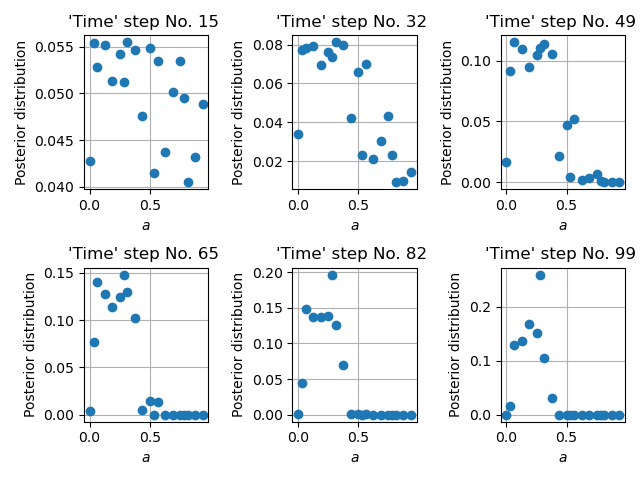

Bayesian filtering
==================

Bayesian filtering is a general framework for estimating the *hidden* state of a dynamical system
from partial observations using a predictive model of the system dynamics.

The state, usually augmented by the system's parameters, changes in time according to a stochastic process,
and the observations are assumed to contain random noise.
The goal of Bayesian filtering is to update the probability distribution of the system's state
whenever new observations become available, using the recursive Bayes' theorem.

.. In the context of Bayesian calibration for materials,
.. the system dynamics is predicted by a material model and the observations are experimental data.
.. The goal is to estimate the probability distribution of the model's parameters
.. from the experimental data using simulations of material responses.

This section describes the theoretical background of Bayesian filtering.
Interested in how GrainLearning provides parameter values to your software?
Then browse directly to :ref:`the sampling module <bayesian_filtering:The sampling module>`.

Bayes' theorem
----------------

Humans are Bayesian machines, constantly using Bayesian reasoning to make decisions and predictions about the world around them.
Bayes' theorem is the mathematical foundation for this process, allowing us to update our beliefs in the face of new evidence,

.. math::

   p(A|B) = \frac{p(B|A) p(A)}{p(B)}.

.. note::
   - :math:`p(A|B)` is the **posterior** probability of hypothesis :math:`A` given evidence :math:`B` has been observed
   - :math:`p(B|A)` is the **likelihood** of observing evidence :math:`B` given hypothesis :math:`A`
   - :math:`p(A)` is the **prior** probability of hypothesis :math:`A`
   - :math:`p(B)` is a **normalizing** constant that ensures the posterior distribution sums to one

At its core, Bayes' theorem is a simple concept: the probability of a hypothesis given some observed evidence
is proportional to the product of the prior probability of the hypothesis
and the likelihood of the evidence given the hypothesis.
Check `this video <https://www.youtube.com/watch?v=HZGCoVF3YvM>`_ for a more intuitive explanation.

The inference module
--------------------

The :mod:`.inference` module contains classes that infer the probability
distribution of model parameters from observation data.
This process is also known as `inverse analysis <https://en.wikipedia.org/wiki/Inverse_problem>`_ or `data assimilation <https://en.wikipedia.org/wiki/Data_assimilation>`_.
The output of the :mod:`.inference` module is the probability distribution over the model state :math:`\vec{x}_t`, 
usually augmented by the parameters :math:`\vec{\Theta}`, conditioned on the observation data :math:`\vec{y}_t` at time :math:`t`.

Sequential Monte Carlo
``````````````````````

The method currently available for statistical inference is :class:`Sequential Monte Carlo <.SMC>`.
It recursively updates the probability distribution of the augmented model state 
:math:`\hat{\vec{x}}_T=(\vec{x}_T, \vec{\Theta})` from the sequences of observation data
:math:`\vec{y}_{0:T}` from time :math:`t = 0` to :math:`T`.
The posterior distribution of the augmented model state is approximated by a set of samples,
where each sample instantiates a realization of the model state.
.. Samples are drawn from a proposal density, which can be either
.. :ref:`informative <sec-inform>`
.. or :ref:`non-informative <sec-noninform>`.

Via Bayes' rule, the posterior distribution of the *augmented model state* reads

.. math::

   p(\hat{\vec{x}}_{0:T}|\vec{y}_{1:T}) \propto \prod_{t_i=1}^T p(\vec{y}_{t_i}|\hat{\vec{x}}_{t_i}) p(\hat{\vec{x}}_{t_i}|\hat{\vec{x}}_{{t_i}-1}) p(\hat{\vec{x}}_0),

Where :math:`p(\hat{\vec{x}}_0)` is the initial distribution of the model state.
We can rewrite this equation in the recursive form, so that the posterior distribution gets updated
at every time step :math:`t`.

.. math::

   p(\hat{\vec{x}}_{0:t}|\vec{y}_{1:t}) \propto p(\vec{y}_t|\hat{\vec{x}}_t)p(\hat{\vec{x}}_t|\hat{\vec{x}}_{t-1})p(\hat{\vec{x}}_{1:t-1}|\vec{y}_{1:t-1}),

Where :math:`p(\vec{y}_t|\hat{\vec{x}}_t)` and :math:`p(\hat{\vec{x}}_t|\hat{\vec{x}}_{t-1})`
are the `likelihood <https://en.wikipedia.org/wiki/Likelihood_function>`_ distribution
and the `transition <https://en.wikipedia.org/wiki/Transition_probability>`_ distribution, respectively.
The likelihood distribution is the probability distribution of observing :math:`\vec{y}_t` given the model state :math:`\hat{\vec{x}}_t`.
The transition distribution is the probability distribution of the model's current state :math:`\hat{\vec{x}}_t` given its previous state :math:`\hat{\vec{x}}_{t-1}`.

.. note::
   We apply no perturbation in the parameters :math:`\vec{\Theta}` nor in the model states :math:`\vec{x}_{1:T}`
   because the model history must be kept intact for path-dependent materials.
   This results in a deterministic transition distribution predetermined from the initial state :math:`p(\hat{\vec{x}}_0)`.

Importance sampling
:::::::::::::::::::

The prior, likelihood, and posterior distributions can be evaluated via `importance sampling <https://en.wikipedia.org/wiki/Importance_sampling>`_.
The idea is to have samples that are more important than others when approximating a target distribution.
The measure of this importance is the so-called **importance weight** (see the figure below).


  Illustration of importance sampling.

Therefore, we draw :attr:`samples <.DynamicSystem.param_data>`, :math:`\vec{\Theta}^{(i)} \ (i=1,...,N_p)`,
from a proposal density, leading to an ensemble of the :attr:`model state <.DynamicSystem.sim_data>` :math:`\vec{x}_t^{(i)}`.
The :attr:`importance weights  <.SMC.posteriors>` :math:`w_t^{(i)}` are updated recursively, via

.. math::

   w_t^{(i)} \propto p(\vec{y}_t|\hat{\vec{x}}_t^{(i)})p(\hat{\vec{x}}_t^{(i)}|\hat{\vec{x}}_{t-1}^{(i)}) w_{t-1}^{(i)}.

The :attr:`likelihood <.SMC.likelihoods>` :math:`p(\vec{y}_t|\hat{\vec{x}}_t^{(i)})`
can be assumed to be a multivariate Gaussian (see the equation below), which is computed by the function :attr:`~.SMC.get_likelihoods`
of the :class:`.SMC` class.

.. math::

   p(\vec{y}_t|\hat{\vec{x}}_t^{(i)}) \propto \exp \{-\frac{1}{2}[\vec{y}_t-\mathbf{H}(\vec{x}^{(i)}_t)]^T {\mathbf{\Sigma}_t^D}^{-1} [\vec{y}_t-\mathbf{H}(\vec{x}^{(i)}_t)]\},

where :math:`\mathbf{H}` is the observation model that reduces to a diagonal matrix for uncorrelated observables,
and :math:`\mathbf{\Sigma}_t^D` is the covariance matrix :attr:`~.SMC.cov_matrices`
calculated from :math:`\vec{y}_t` and the user-defined normalized variance :attr:`~.DynamicSystem.sigma_max`, in the function :attr:`~.SMC.get_covariance_matrices`.

By making use of importance sampling, the posterior distribution
:math:`p(\vec{y}_t|\hat{\vec{x}}_t^{(i)})` gets updated over time in :attr:`~.SMC.data_assimilation_loop`
--- this is known as `Bayesian updating <https://statswithr.github.io/book/the-basics-of-bayesian-statistics.html#bayes-updating>`_.
Figure below illustrates the evolution of a posterior distribution over time.



  Time evolution of the importance weights over model parameter :math:`a`.

Ensemble predictions
::::::::::::::::::::

Since the importance weight on each sample :math:`\vec{\Theta}^{(i)}` is discrete
and the sample :math:`\vec{\Theta}^{(i)}` and model state :math:`\vec{x}_t^{(i)}` have one-to-one correspondence,
the ensemble mean and variance of :math:`f_t`, an arbitrary function of the model's augmented state :math:`\hat{\vec{x}}_t`,
can be computed as 

.. math::

   \mathrm{\widehat{E}}[f_t(\hat{\vec{x}}_t)|\vec{y}_{1:t}] & = \sum_{i=1}^{N_p} w_t^{(i)} f_t(\hat{\vec{x}}_t^{(i)}),
   
   \mathrm{\widehat{Var}}[f_t(\hat{\vec{x}}_t)|\vec{y}_{1:t}] & = \sum_{i=1}^{N_p} w_t^{(i)} (f_t(\hat{\vec{x}}_t^{(i)})-\mathrm{\widehat{E}}[f_t(\hat{\vec{x}}_t)|\vec{y}_{1:t}])^2,

The figure below gives an example of the ensemble prediction in darkred, the top three fits in blue, orange, and green, and the observation data in black.


The sampling module
--------------------

The sampling module allows drawing samples from

- a :ref:`non-informative <sec-noninform>` uniform distribution
- an :ref:`informative <sec-inform>` proposal density designed and optimized to make the inference efficient

.. _sec-noninform:
Sampling from low-discrepancy sequences
```````````````````````````````````````

Since we typically don't know the prior distribution of model parameters,
we start with a non-informative, uniform sampling using `quasi-random <https://en.wikipedia.org/wiki/Low-discrepancy_sequence>`_
or `near-random <https://en.wikipedia.org/wiki/Latin_hypercube_sampling>`_ numbers.
We make use of the `Quasi-Monte Carlo generators of scipy <https://docs.scipy.org/doc/scipy/reference/stats.qmc.html>`_.

You can choose one of the sampling methods when initializing a :class:`.IterativeBayesianFilter` object.

- `"sobol"`: a `Sobol sequence <https://docs.scipy.org/doc/scipy/reference/generated/scipy.stats.qmc.Sobol.html#scipy.stats.qmc.Sobol>`_
- `"halton"`: a `Halton sequence <https://docs.scipy.org/doc/scipy/reference/generated/scipy.stats.qmc.Halton.html#scipy.stats.qmc.Halton>`_
- `"LH"`: a `Latin Hypercube <https://docs.scipy.org/doc/scipy/reference/generated/scipy.stats.qmc.LatinHypercube.html#scipy.stats.qmc.LatinHypercube>`_

.. code-block:: python
   :caption: Initialize the Bayesian calibration method

   ibf_cls = IterativeBayesianFilter.from_dict(
       {
           "inference":{
               "ess_target": 0.3,
           },
           "sampling":{
               "max_num_components": 1
           }
           "initial_sampling": "halton"
       }
   )

The figure below shows parameter samples generated using a Halton sequence, a Sobol sequence and a Latin Hypercube in 2D.

.. figure:: ./figs/qmc.png
  :width: 400
  :alt: Quasi-Monte Carlo generator

.. _sec-inform:
Sampling from a proposal density function
`````````````````````````````````````````

An initial uniform sampling is unbiased, but it can be very inefficient since the correlation structure is not sampled.
If we have some vague idea of the posterior distribution, we can come up with a proposal density.
For that, we can use the :class:`.GaussianMixtureModel` class which is a wrapper of `BayesianGaussianMixture <https://scikit-learn.org/stable/modules/generated/sklearn.mixture.BayesianGaussianMixture.html>`_ of scikit-learn.

.. note::
   Note that `BayesianGaussianMixture <https://scikit-learn.org/stable/modules/generated/sklearn.mixture.BayesianGaussianMixture.html>`_
   is based on a variational Bayesian estimation of a Gaussian mixture,
   meaning the parameters of a Gaussian mixture distribution are inferred.
   For example, the number of components is optimized rather than an input of the Gaussian mixture.

The **non-parametric** :attr:`Gaussian mixture <.GaussianMixtureModel.gmm>` can be trained using the previously generated samples
and their importance weights estimated by the :mod:`.inference` method.
New samples are then drawn from this mixture model that acts as a proposal density in :attr:`~.GaussianMixtureModel.regenerate_params`. 


  Resampling of parameter space via a Gaussian mixture model.

Iterative Bayesian filter
-------------------------

.. The `iterative Bayesian filtering algorithm <https://doi.org/10.1016/j.cma.2019.01.027>`_ combines sequential Monte Carlo filtering for inference
.. and non-parametric Gaussian mixtures for (re)sampling.
.. Sequential Monte Carlo combined with quasi- or near-random sequence sampling
.. leads to the so-called sequential quasi-Monte Carlo (SQMC) filter whose necessary number of samples is proportional to :math:`d\log{d}`.
.. Although the SQMC filter is unbiased, it is highly inefficient and ensured to degenerate.

The idea of `iterative Bayesian filtering algorithm <https://doi.org/10.1016/j.cma.2019.01.027>`_ is to solve the inverse problem all over again, with new samples drawn from a more sensible proposal density,
leading to a multi-level resampling strategy to avoid weight degeneracy and improve efficiency. 
The essential steps include

1. Generating the initial samples using :attr:`a low-discrepancy sequence <.IterativeBayesianFilter.initialize>`,
2. Running the instances of the predictive (forward) model via a user-defined :ref:`callback function <dynamic_systems:Interact with third-party software via callback function>`,
3. Estimating the time evolution of :attr:`the posterior distribution <.IterativeBayesianFilter.run_inference>`,
4. Generateing new samples from :attr:`the proposal density <.IterativeBayesianFilter.run_sampling>`, trained with the previous ensemble (i.e., samples and associated weights), 
5. Check whether the posterior expecation of the model parameters has converged to a certain value, and stop the iteration if so.
6. If not, repeating step 1--5 (combined into the function :attr:`.IterativeBayesianFilter.solve`)

.. warning::
   When running :class:`.SMC` filtering via :attr:`.IterativeBayesianFilter.run_inference`,
   it is crucial to ensure that the :attr:`effective sample size <.SMC.ess>` is large enough,
   so that the ensemble does not degenerate into few samples with very large weights.

The figure below illustrates the workflow of iterative Bayesian filtering.


